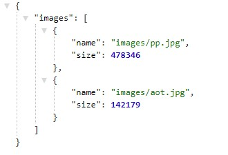

# image-lambda

## Lambda Function

- Upload an image to the S3 bucket. This will initiate the function.

- lambda willl update the images.json file, or create one if it does not exist.

- All images uploaded to the S3 bucket will have their name and size added to images.json.

## How to use

1. Upload image into `images/` folder in the s3 bucket.

2. Uploading an image will trigger the lambda function to fire.

3. Lambda checks for existing `images.json`, or creates one if it does not exist.

4. Lambda checks for existing file name. If it exists it updates the file size, if it does not exist it creates a new object with the name and file size.

## Lambda

[images.json](https://luis-401n21-images.s3.us-west-2.amazonaws.com/images.json)

